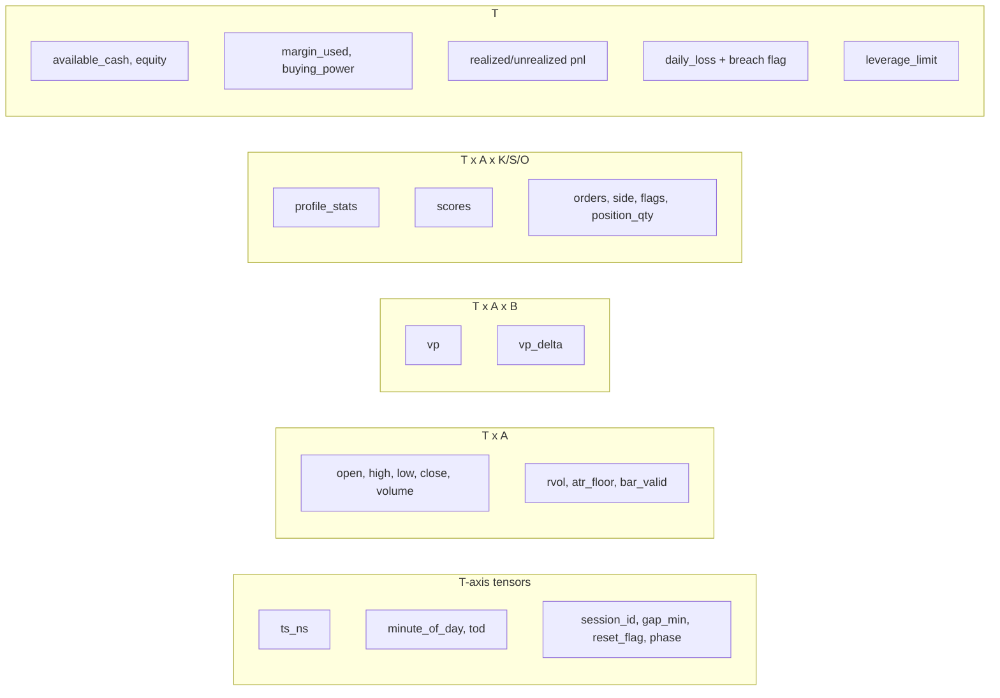
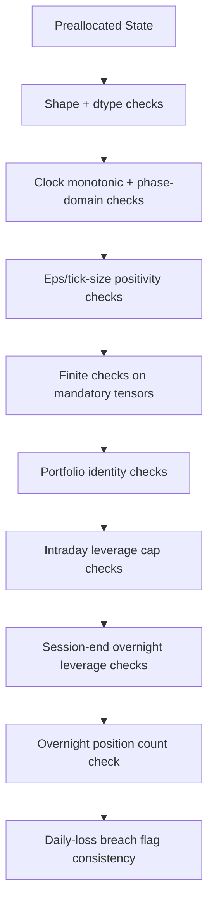
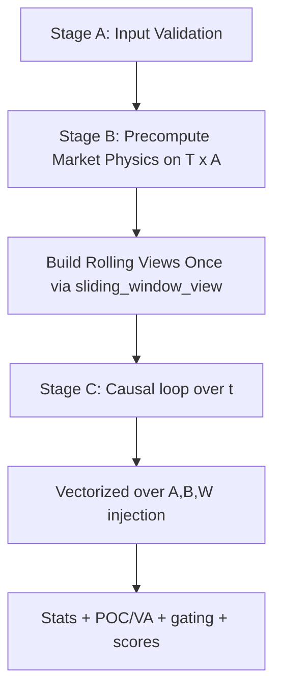

# WEIGHTIZ TECH SPEC
## Module 1 - Core Tensor Engine, Deterministic Clock, and Portfolio Constraints

Version: `M1-CORE-v1`  
Status: Draft (Implementation-ready)  
Code reference: [weightiz_module1_core.py](/Users/afekshusterman/Documents/New project/weightiz_module1_core.py)

---

## 1. Scope and Intent

Module 1 is the deterministic foundation of the full Weightiz institutional engine.  
It does **not** implement strategy alpha yet. It defines:

1. Canonical tensor state schema.
2. Vectorized session clock with DST-aware UTC -> US/Eastern conversion.
3. Multi-asset typed epsilon logic based on `tick_size[a]`.
4. Portfolio and margin vectors required by Zimtra-style constraints.
5. Fail-closed validations and deterministic replay diagnostics.

### 1.1 Non-negotiable constraints

1. No `pandas`/`polars`/`vectorbt`/`backtrader` in core path.
2. Numpy + stdlib only.
3. Pre-allocated state tensors only.
4. Deterministic output for identical input and seed.
5. Fail-closed on shape/dtype/non-finite/constraint violations.
6. Per-asset tick sizes are mandatory.
7. Overnight positions hard-capped to one.

---

## 2. Architecture Overview

```mermaid
flowchart TD
    A[EngineConfig + symbols + ts_ns] --> B[Config Validation]
    B --> C[Typed Eps from tick_size[a]]
    B --> D[x_grid Build]
    B --> E[Vectorized DST Clock Build]
    C --> F[State Pre-allocation]
    D --> F
    E --> F
    F --> G[Hard Validation]
    G --> H[Deterministic Digest + Memory Report]
```

### 2.1 State layers



---

## 3. Tensor Schema (Canonical)

### 3.1 Index conventions

1. Time index: `t = 0..T-1`.
2. Asset index: `a = 0..A-1`.
3. Profile bin index: `i = 0..B-1`.

### 3.2 Tensors

| Name | Shape | Dtype | Description |
|---|---:|---|---|
| `ts_ns` | `(T,)` | `int64` | UTC timestamps in nanoseconds |
| `minute_of_day` | `(T,)` | `int16` | ET minute of day in `[0,1439]` |
| `tod` | `(T,)` | `int16` | Minutes since 09:30 ET |
| `session_id` | `(T,)` | `int64` | Monotonic session counter |
| `gap_min` | `(T,)` | `float64` | Minute gap from previous bar |
| `reset_flag` | `(T,)` | `int8` | Session/gap reset indicator |
| `phase` | `(T,)` | `int8` | Warmup/Live/Select/Flatten |
| `x_grid` | `(B,)` | `float64` | Normalized profile lattice |
| `open_px` | `(T,A)` | `float64` | Open input |
| `high_px` | `(T,A)` | `float64` | High input |
| `low_px` | `(T,A)` | `float64` | Low input |
| `close_px` | `(T,A)` | `float64` | Close input |
| `volume` | `(T,A)` | `float64` | Volume input |
| `rvol` | `(T,A)` | `float64` | Relative volume input |
| `atr_floor` | `(T,A)` | `float64` | ATR floor input |
| `bar_valid` | `(T,A)` | `bool` | Loaded data validity bit |
| `vp` | `(T,A,B)` | `float64` | Profile mass tensor |
| `vp_delta` | `(T,A,B)` | `float64` | Delta profile tensor |
| `profile_stats` | `(T,A,K)` | `float64` | Derived stats channels |
| `scores` | `(T,A,S)` | `float64` | Alpha score channels |
| `orders` | `(T,A,O)` | `float64` | Order intent channels |
| `order_side` | `(T,A)` | `int8` | -1/0/+1 side |
| `order_flags` | `(T,A)` | `uint16` | Rule/kill-switch flags |
| `position_qty` | `(T,A)` | `float64` | Position quantity |
| `overnight_mask` | `(T,A)` | `int8` | Overnight holder indicator |
| `available_cash` | `(T,)` | `float64` | Cash balance |
| `equity` | `(T,)` | `float64` | Account equity |
| `margin_used` | `(T,)` | `float64` | Margin utilization |
| `buying_power` | `(T,)` | `float64` | Tradable buying power |
| `realized_pnl` | `(T,)` | `float64` | Realized PnL |
| `unrealized_pnl` | `(T,)` | `float64` | Unrealized PnL |
| `daily_loss` | `(T,)` | `float64` | Day loss absolute metric |
| `daily_loss_breach_flag` | `(T,)` | `int8` | Daily loss kill switch bit |
| `leverage_limit` | `(T,)` | `float64` | Active leverage cap |

---

## 4. Mathematical Definitions

## 4.1 Typed epsilon policy (multi-asset)

Scalar components:

\[
\epsilon_{pdf} = 10^{-12}, \quad \epsilon_{vol} = 10^{-12}
\]

Asset-specific components:

\[
\epsilon_{div}[a] = tick\_size[a], \quad \epsilon_{range}[a] = tick\_size[a], \quad a=0,\dots,A-1
\]

Hard validity:

\[
tick\_size[a] > 0 \quad \forall a
\]

This is required to avoid cross-asset normalization distortion.

## 4.2 Profile grid

\[
x_i = x_{min} + i\Delta x,\quad i=0,\dots,B-1
\]

with strict monotonicity and uniform spacing:

\[
x_{i+1} - x_i = \Delta x > 0
\]

Float64-safe spacing validation:

\[
\max_i \left| (x_{i+1}-x_i)-\Delta x \right| \le 10^{-12}
\]

Implementation equivalent:
`np.allclose(np.diff(x_grid), dx, rtol=0.0, atol=1e-12)`.

## 4.3 Vectorized DST-aware clock

Given monotonic UTC nanoseconds \(ts_t^{UTC}\):

1. Compute year per timestamp.
2. For each year \(y\), precompute DST bounds in UTC:
   - \(s_y\): second Sunday in March at 07:00 UTC.
   - \(e_y\): first Sunday in November at 06:00 UTC.
3. Compute vectorized offset:

\[
o_t =
\begin{cases}
-240 & \text{if } s_{y(t)} \le ts_t^{UTC} < e_{y(t)} \\
-300 & \text{otherwise}
\end{cases}
\]

4. Convert to ET nanoseconds:

\[
ts_t^{ET} = ts_t^{UTC} + o_t \cdot 60 \cdot 10^9
\]

5. Minute index and minute of day:

\[
m_t^{idx} = \left\lfloor \frac{ts_t^{ET}}{60\cdot10^9} \right\rfloor,\quad
minute\_of\_day_t = m_t^{idx}\bmod 1440
\]

6. Time-of-day since RTH open:

\[
tod_t = minute\_of\_day_t - 570
\]

7. Session id from ET day index:

\[
day_t^{ET} = \left\lfloor \frac{ts_t^{ET}}{24\cdot60\cdot10^9} \right\rfloor
\]
\[
session\_change_t = \mathbf{1}[t=0] \lor \mathbf{1}[day_t^{ET}\ne day_{t-1}^{ET}]
\]
\[
session\_id_t = \sum_{j=0}^{t} session\_change_j - 1
\]

8. Gap and reset:

\[
gap\_min_t =
\begin{cases}
0, & t=0 \\
\frac{ts_t^{UTC}-ts_{t-1}^{UTC}}{60\cdot10^9}, & t>0
\end{cases}
\]
\[
reset_t = \mathbf{1}[gap\_min_t > gap\_reset\_minutes] \lor session\_change_t
\]

9. Phase:

\[
phase_t =
\begin{cases}
WARMUP, & tod_t < warmup \\
LIVE, & tod_t \ge warmup \land minute\_of\_day_t < flat\_time \\
OVERNIGHT\_SELECT, & minute\_of\_day_t = flat\_time \land tod_t \ge warmup \\
FLATTEN, & minute\_of\_day_t > flat\_time
\end{cases}
\]

---

## 5. Zimtra Hard-Constraint Formulas

## 5.1 Overnight cap

\[
N_t^{overnight} = \sum_{a=0}^{A-1} overnight\_mask_{t,a}
\]
\[
N_t^{overnight} \le 1, \quad \forall t
\]

## 5.2 Buying power identity

\[
buying\_power_t = equity_t\cdot L^{intraday} - margin\_used_t
\]

Module 1 keeps this identity at intraday enforcement leverage through the flatten window.

## 5.3 Margin cap

\[
margin\_used_t \le equity_t\cdot L^{intraday}, \quad \forall t
\]

## 5.4 Overnight leverage enforcement at session close

Let:

\[
end_t = \mathbf{1}[t=T-1] \lor \mathbf{1}[session\_id_t \ne session\_id_{t+1}]
\]

Then:

\[
margin\_used_t \le equity_t\cdot L^{overnight}, \quad \forall t \text{ where } end_t=1
\]

This avoids false fail-close exactly at FLATTEN transition before liquidation has completed.

## 5.5 Daily loss breach consistency

\[
daily\_loss\_breach\_flag_t = \mathbf{1}[daily\_loss_t \ge daily\_loss\_limit\_abs]
\]

## 5.6 OHLCV physical validity constraints (loaded slices)

For each loaded bar `(t,a)` where `bar_valid[t,a]=1`:

\[
H_{t,a} \ge L_{t,a}
\]
\[
H_{t,a} \ge O_{t,a}, \quad H_{t,a} \ge C_{t,a}
\]
\[
L_{t,a} \le O_{t,a}, \quad L_{t,a} \le C_{t,a}
\]
\[
V_{t,a} \ge 0,\quad ATR^{floor}_{t,a} > 0
\]

---

## 6. Constraint Evaluation Flow



---

## 7. Determinism and Replay Audit

Module 1 exposes a deterministic SHA-256 digest over critical arrays:

1. clock vectors (`ts_ns`, `minute_of_day`, `tod`, `session_id`, `gap_min`, `reset_flag`, `phase`)
2. typed eps vectors (`eps_div`, `eps_range`)
3. core profile tensors (`vp`, `vp_delta`)
4. position and portfolio vectors

If inputs and seed are unchanged, digest must remain unchanged.

---

## 8. API Surface

1. `preallocate_state(ts_ns, cfg, symbols) -> TensorState`
2. `build_x_grid(cfg) -> np.ndarray`
3. `build_session_clock_vectorized(ts_ns, cfg) -> dict[str, np.ndarray]`
4. `validate_state_hard(state) -> None`
5. `validate_loaded_market_slice(state, t_start, t_end) -> None`
6. `memory_report_bytes(state) -> dict[str, int]`
7. `deterministic_digest_sha256(state) -> str`

---

## 9. Module 1 Design Notes

1. Module 1 intentionally leaves market tensors as NaN placeholders until loader fills them.
2. Hard finite checks apply to mandatory finite tensors immediately.
3. `validate_loaded_market_slice` is used post-load to enforce OHLCV integrity.
4. No alpha computation is performed here; this module is purely deterministic state infrastructure.

---

## 10. Handoff to Module 2

Module 2 will consume:
1. input tensors: `open_px/high_px/low_px/close_px/volume/rvol/atr_floor`
2. state controls: `phase/reset_flag/session_id/tod`
3. typed eps vectors from tick size
4. write targets: `vp/vp_delta/profile_stats/scores`

Module 2 must not alter schema without version bump.

---

## Module 2 - Core Weightiz Profile Engine (Deterministic, Numpy-Only)

Version: `M2-PROFILE-v1`  
Status: Implementation-ready / coded  
Code reference: [weightiz_module2_core.py](/Users/afekshusterman/Documents/New project/weightiz_module2_core.py)

### 1. Purpose and Scope

Module 2 transforms loaded OHLCV tensors from Module 1 into deterministic profile tensors and executable score channels.

It provides:

1. Causal market-physics precompute on `(T, A)`:
   - ATR EMA + hard floor + effective ATR.
   - Session cumulative volume.
   - RVOL from causal 20-session Time-of-Day medians.
   - Candle micro-physics: `range_`, `body_pct`, `clv`, `sigma1`, `sigma2`, `w1`, `w2`.
2. Causal profile engine on `(T, A, B)`:
   - Rolling coordinate reprojection.
   - Two-component Gaussian mass injection.
   - Signed hybrid delta accumulation.
   - Moment extraction, POC/VA extraction, and continuous gating scores.
3. Strict tie-break policy for POC:
   - maximize mass;
   - then minimize `|x|`;
   - then choose smaller `x` (left).

Hard constraints preserved:

1. No pandas/polars/vectorbt/backtrader in core path.
2. Pre-allocated tensors only.
3. Float64 deterministic math.
4. Fail-closed on shape/non-finite/physics violations.
5. No look-ahead in ATR or RVOL baseline construction.

---

### 2. Public Interfaces

```python
@dataclass(frozen=True)
class Module2Config: ...

@dataclass
class MarketPhysics: ...

def precompute_market_physics(state: TensorState, cfg: Module2Config) -> MarketPhysics

def run_weightiz_profile_engine(state: TensorState, cfg: Module2Config) -> None

def compute_profile_taxonomy_snapshot(...)-> np.ndarray
```

---

### 3. Tensor Schemas and Contracts

#### 3.1 Inputs (from Module 1)

| Tensor | Shape | Dtype | Role |
|---|---:|---|---|
| `open_px, high_px, low_px, close_px, volume` | `(T,A)` | `float64` | Market bars |
| `bar_valid` | `(T,A)` | `bool` | Validity bit |
| `session_id` | `(T,)` | `int64` | Session segmentation |
| `minute_of_day` | `(T,)` | `int16` | ToD key for RVOL baseline |
| `phase, reset_flag` | `(T,)` | `int8` | Gating / reset policy |
| `x_grid` | `(B,)` | `float64` | Normalized profile lattice |
| `eps.eps_div/eps_range` | `(A,)` | `float64` | Asset-typed eps from tick size |

#### 3.2 Stage-B Outputs (`MarketPhysics`)

| Field | Shape | Dtype |
|---|---:|---|
| `atr_raw` | `(T,A)` | `float64` |
| `atr_floor` | `(T,A)` | `float64` |
| `atr_eff` | `(T,A)` | `float64` |
| `cumvol` | `(T,A)` | `float64` |
| `rvol` | `(T,A)` | `float64` |
| `range_` | `(T,A)` | `float64` |
| `body_pct` | `(T,A)` | `float64` |
| `clv` | `(T,A)` | `float64` |
| `sigma1` | `(T,A)` | `float64` |
| `sigma2` | `(T,A)` | `float64` |
| `w1` | `(T,A)` | `float64` |
| `w2` | `(T,A)` | `float64` |
| `rvol_eligible` | `(T,A)` | `bool` |

#### 3.3 Stage-C Writes to Canonical State

| Tensor | Shape | Dtype | Meaning |
|---|---:|---|---|
| `state.rvol` | `(T,A)` | `float64` | Computed RVOL |
| `state.atr_floor` | `(T,A)` | `float64` | Effective ATR denominator (`atr_eff`) |
| `state.vp` | `(T,A,B)` | `float64` | Unsiged profile mass |
| `state.vp_delta` | `(T,A,B)` | `float64` | Signed delta mass |
| `state.profile_stats` | `(T,A,K)` | `float64` | Section 13 channels |
| `state.scores` | `(T,A,S)` | `float64` | Section 14 channels |

---

### 4. Stage A - Fail-Closed Input Validation

Validation is strict and deterministic.

For every valid bar `(t,a)` where `bar_valid[t,a]=1`:

\[
H_{t,a} \ge L_{t,a},\quad
H_{t,a} \ge O_{t,a},\quad
H_{t,a} \ge C_{t,a},\quad
L_{t,a} \le O_{t,a},\quad
L_{t,a} \le C_{t,a},\quad
V_{t,a} \ge 0
\]

Tick constraints:

\[
\epsilon_{div}[a] = tick\_size[a] > 0,\quad a=0,\dots,A-1
\]

If any rule fails: raise immediately with concrete index.

---

### 5. Stage B - Causal Market Physics

#### 5.1 True Range and ATR EMA

Forward-filled close for invalid bars:

\[
\tilde{C}_{t,a}=
\begin{cases}
C_{t,a}, & valid_{t,a}=1 \\
\tilde{C}_{t-1,a}, & valid_{t,a}=0
\end{cases}
\]

True range:

\[
TR_{t,a}=\max\left(
H_{t,a}-L_{t,a},
\left|H_{t,a}-\tilde{C}_{t-1,a}\right|,
\left|L_{t,a}-\tilde{C}_{t-1,a}\right|
\right)
\]

Causal EMA:

\[
ATR^{raw}_{0,a}=TR_{0,a}
\]
\[
ATR^{raw}_{t,a}=\alpha TR_{t,a} + (1-\alpha)ATR^{raw}_{t-1,a},\quad t\ge1
\]

where `\alpha = 2/(span+1)` unless explicitly configured.

#### 5.2 ATR Hard Floor and Effective Denominator

Asset floor:

\[
ATR^{floor}_{a}=\max\left(\lambda_{tick}\cdot tick\_size[a],\ ATR^{abs}[a]\right)
\]

Broadcast over time:

\[
ATR^{floor}_{t,a}=ATR^{floor}_{a}
\]

Effective ATR (used for normalization):

\[
ATR^{eff}_{t,a}=\max\left(ATR^{raw}_{t,a}, ATR^{floor}_{t,a}\right)
\]

#### 5.3 Session Cumulative Volume

\[
CumVol_{t,a}=
\begin{cases}
V_{t,a}, & session\_id_t \neq session\_id_{t-1} \\
CumVol_{t-1,a}+V_{t,a}, & \text{otherwise}
\end{cases}
\]

#### 5.4 RVOL (20-session ToD median baseline, causal)

For session `d`, minute bucket `m`, asset `a`:

\[
Base(d,m,a)=\operatorname{median}\left(\{CumVol(d',m,a): d'<d,\ d-d'\le L\}\right)
\]

with `L = rvol_lookback_sessions`.

RVOL:

\[
RVOL_{t,a}=\frac{CumVol_{t,a}}{\max\left(Base(session_t, minute_t, a),\epsilon_{vol}[a]\right)}
\]

No-look-ahead guarantee: baseline excludes current session by construction (`d' < d`).

Insufficient-history policy:

1. `neutral_one` -> set RVOL to `1.0` where baseline unavailable.
2. `warmup_mask` -> same neutral fill + explicit eligibility mask.
3. `nan_fail` -> raise error.

#### 5.5 Candle Micro-Physics (precomputed once over `(T,A)`)

Range and body:

\[
Range_{t,a}=\max(H_{t,a}-L_{t,a},\epsilon_{range}[a])
\]
\[
BodyPct_{t,a}=\frac{|C_{t,a}-O_{t,a}|}{Range_{t,a}}
\]

CLV:

\[
CLV_{t,a}=\frac{(C_{t,a}-L_{t,a})-(H_{t,a}-C_{t,a})}{Range_{t,a}}
\in[-1,1]
\]

Sigma/weights parameterization (deterministic, config-driven):

\[
\sigma_1 = f_1(BodyPct, RVOL, Range/ATR^{eff})
\]
\[
\sigma_2 = f_2(\sigma_1, BodyPct, |CLV|)
\]
\[
w_1 = g(BodyPct, RVOL, |CLV|),\quad w_2=1-w_1
\]

with strict clamps and positivity constraints:

\[
\sigma_1>0,\ \sigma_2>0,\ w_1\in[w_{min},w_{max}],\ w_2\in[0,1],\ |(w_1+w_2)-1|\le10^{-12}
\]

#### 5.6 Robust Volume Cap (Section 9.2)

For each bar and asset, trailing robust volume statistics are precomputed causally with `sliding_window_view`:

\[
MedV_{t,a}=median(V_{u,a}),\quad u\in[t-W_V+1,\dots,t]
\]
\[
MADV_{t,a}=median(|V_{u,a}-MedV_{t,a}|)
\]

Effective cap:

\[
Cap^{base}_{t,a}=MedV_{t,a}+\kappa_V\cdot 1.4826\cdot MADV_{t,a}
\]
\[
Cap^{exp}_{t,a}=Cap^{base}_{t,a}\cdot\left(1+\log(\max(1,RVOL_{t,a}))\right)
\]
\[
Cap^{eff}_{t,a}=\max\left(Cap^{exp}_{t,a},\ \lambda_V\cdot MedV_{t,a}\right)
\]

Profile-injection volume:

\[
V^{prof}_{t,a}=\min(V_{t,a}, Cap^{eff}_{t,a})
\]

#### 5.7 Hybrid Delta Return Scale (Section 10 precompute)

Signed return and normalized return:

\[
r_{t,a}=C_{t,a}-C_{t-1,a}
\]
\[
r^{norm}_{t,a}=\frac{r_{t,a}}{ATR^{eff}_{t,a}+\epsilon_{div}[a]}
\]

Rolling robust return scale:

\[
s_r(t,a)=\max\left(1.4826\cdot MAD(r^{norm}_{u,a}),\ s_{r,min}\right),\quad u\in[t-W_r+1,\dots,t]
\]

---

### 6. Stage C - Rolling Profile Engine

#### 6.1 Rolling window tensorization

Single construction using `sliding_window_view`:

- `close_w, vol_w, valid_w, clv_w, sig1_w, sig2_w, w1_w, w2_w, body_w, rvol_w, cap_w, ret_norm_w, s_r_w`
- each shaped `(T-W+1, W, A)`.

No per-window reconstruction is allowed.

#### 6.2 Coordinate reprojection (causal)

For end time `t` and lagged bar `k` in window:

\[
\mu_{k\to t,a}=\frac{C_{k,a}-C_{t,a}}{ATR^{eff}_{t,a}+\epsilon_{div}[a]}
\]

#### 6.3 Two-component probabilistic injection

Component centers:

\[
\mu_1=\mu + \eta_1\cdot CLV,
\quad
\mu_2=\mu + \eta_2\cdot CLV
\]

Gaussian kernels on lattice `x_i`:

\[
\phi_j(i)=\frac{1}{\sigma_j\sqrt{2\pi}}\exp\left(-\frac{1}{2}\left(\frac{x_i-\mu_j}{\sigma_j}\right)^2\right),\ j\in\{1,2\}
\]

Mixture and per-candle normalization:

\[
Mix(i)=w_1\phi_1(i)+w_2\phi_2(i)
\]
\[
\widetilde{Mix}(i)=\frac{Mix(i)}{\sum_i Mix(i)\Delta x+\epsilon_{pdf}}
\]

Mass injection:

\[
Mass_{k\to t,a}(i)=V^{prof}_{k,a}\cdot RVOL_{k,a}\cdot \widetilde{Mix}_{k\to t,a}(i)
\]

Accumulation:

\[
VP_{t,a}(i)=\sum_{k\in W_t} Mass_{k\to t,a}(i)
\]

#### 6.4 Hybrid delta layer

\[
pSR_{buy}(k,a)=\sigma\left(\ln(9)\cdot \frac{r^{norm}_{k,a}}{s_r(k,a)+\epsilon_{div}[a]}\right)
\]
\[
pCLV_{buy}(k,a)=\sigma\left(6\cdot CLV_{k,a}\right)
\]
\[
w_{trend}(k,a)=BodyPct_{k,a}
\]
\[
p_{buy}(k,a)=w_{trend}(k,a)\cdot pSR_{buy}(k,a)+\left(1-w_{trend}(k,a)\right)\cdot pCLV_{buy}(k,a)
\]
\[
SignBlend_{k,a}=2\cdot p_{buy}(k,a)-1
\]
\[
VP^{\Delta}_{t,a}(i)=\sum_{k\in W_t} Mass_{k\to t,a}(i)\cdot SignBlend_{k,a}
\]

#### 6.5 Moments and structural stats

\[
S_{t,a}=\sum_i VP_{t,a}(i)
\]
\[
\mu^{prof}_{t,a}=\frac{\sum_i VP_{t,a}(i)x_i}{S_{t,a}+\epsilon_{vol}}
\]
\[
\sigma^{prof}_{t,a}=\sqrt{\max\left(\frac{\sum_i VP_{t,a}(i)x_i^2}{S_{t,a}+\epsilon_{vol}}-(\mu^{prof}_{t,a})^2,0\right)}
\]
\[
\sigma^{eff}_{t,a}=\max(\sigma^{prof}_{t,a}, 2\Delta x)
\]
\[
D_{t,a}=\frac{-\mu^{prof}_{t,a}}{\sigma^{eff}_{t,a}+\epsilon_{pdf}},\quad D^{clip}_{t,a}=clip(D_{t,a},-6,6)
\]

Affinity at zero bin `i0 = argmin_i |x_i|`:

\[
A_{t,a}=\frac{VP_{t,a}(i0)}{\max_i VP_{t,a}(i)+\epsilon_{vol}}
\]

#### 6.6 Strict POC tie-break (paper-compliant)

Candidate set:

\[
\mathcal{C}_{t,a}=\{i: VP_{t,a}(i)=\max_j VP_{t,a}(j)\}
\]

Selection:

\[
POC_{t,a}=\arg\min_{i\in\mathcal{C}_{t,a}} \left(|x_i|, x_i\right)
\]

Operational equivalent:

1. rank bins by lexicographic key `(|x|, x)` ascending;
2. choose candidate with minimal rank.

This exactly enforces “closer to zero, then left”.

#### 6.7 Value Area extraction (offset scan)

Offsets: `[0, +1, -1, +2, -2, ...]`.

For each asset:

1. accumulate profile mass in offset order around POC;
2. stop at first offset index where cumulative mass reaches `\theta_{VA}=0.70` of total mass;
3. mapped min/max included indices define `IVAL`, `IVAH`.

#### 6.8 Delta gating and score channels

Center and POC deltas:

\[
\delta_0 = \frac{VP^{\Delta}(i0)}{VP(i0)+\epsilon_{vol}},
\quad
\delta_{poc}=\frac{VP^{\Delta}(POC)}{VP(POC)+\epsilon_{vol}}
\]

Effective delta:

\[
\delta_{eff}=(1-A)\delta_{poc}+A\delta_0
\]

Robust scale (causal MAD over session-aware trailing window):

\[
\sigma_{\Delta}=\max\left(1.4826\cdot MAD(\delta_{eff}),\ 1.4826\cdot MAD(\Delta\delta_{eff}),\ \sigma_{\Delta,min}\right)
\]

Implementation architecture:

1. Stage C computes `\delta_eff` only (hot loop).
2. Stage F computes rolling MAD scales with `sliding_window_view` outside the hot loop, session-by-session.
3. Stage F writes `z_\Delta`, gates, and final scores.

SNR:

\[
z_{\Delta}=\frac{\delta_{eff}}{\sigma_{\Delta}+\epsilon_{pdf}}
\]

Gates:

\[
G_{break}=\sigma\left(\ln 9\cdot (z_{\Delta}-\theta_{\Delta})\right)
\]
\[
G_{reject}=\sigma\left(\ln 9\cdot (-z_{\Delta}-\theta_{\Delta})\right)
\]

Base scores:

\[
S^{base}_{bo,long}=\sigma(D^{clip}-b_{bo})\cdot RVOL
\]
\[
S^{base}_{bo,short}=\sigma(-D^{clip}-b_{bo})\cdot RVOL
\]
\[
RVOL^{trend}=\mathbf{1}[RVOL>\theta_{rvol}]\cdot\mathbf{1}[BodyPct>\theta_{body}]
\]
\[
S^{base}_{reject}=\sigma(c_{rej}-|D^{clip}|)\cdot A\cdot(1-RVOL^{trend})
\]

Final outputs:

\[
S_{bo,long}=S^{base}_{bo,long}\cdot G_{break},
\quad
S_{bo,short}=S^{base}_{bo,short}\cdot G_{break}
\]
\[
S_{reject}=S^{base}_{reject}\cdot G_{reject}
\]
\[
S_{rej,long}=S_{reject}\cdot\sigma(-D^{clip}),
\quad
S_{rej,short}=S_{reject}\cdot\sigma(D^{clip})
\]

---

### 7. Exact Channel Mapping

#### 7.1 `profile_stats[t,a,k]`

| `k` | Enum | Meaning |
|---:|---|---|
| 0 | `MU_PROF` | `\mu_prof` |
| 1 | `SIGMA_PROF` | `\sigma_prof` |
| 2 | `SIGMA_EFF` | `\sigma_eff` |
| 3 | `D` | raw deviation |
| 4 | `DCLIP` | clipped deviation |
| 5 | `A_AFFINITY` | affinity |
| 6 | `DELTA0` | center delta |
| 7 | `DELTA_POC` | POC delta |
| 8 | `DELTA_EFF` | effective delta |
| 9 | `Z_DELTA` | SNR delta |
| 10 | `GBREAK` | breakout gate |
| 11 | `GREJECT` | rejection gate |
| 12 | `IPOC` | POC bin index |
| 13 | `IVAH` | VAH bin index |
| 14 | `IVAL` | VAL bin index |

#### 7.2 `scores[t,a,s]`

| `s` | Enum | Meaning |
|---:|---|---|
| 0 | `SCORE_BO_LONG` | breakout long score |
| 1 | `SCORE_BO_SHORT` | breakout short score |
| 2 | `SCORE_REJECT` | rejection aggregate score |
| 3 | `SCORE_REJ_LONG` | rejection long projection |
| 4 | `SCORE_REJ_SHORT` | rejection short projection |

---

### 8. Fail-Closed Invariant Table

| Invariant | Condition | Action |
|---|---|---|
| OHLC physics | any `H<L`, `H<O`, `H<C`, `L>O`, `L>C` on valid bars | raise |
| Volume validity | any `V<0` on valid bars | raise |
| Tick validity | any `tick_size<=0` | raise |
| ATR sigma validity | any `sigma1<=0` or `sigma2<=0` | raise |
| Weight conservation | `|w1+w2-1| > 1e-12` | raise |
| Non-finite Stage B | any NaN/Inf in physics arrays | raise |
| Non-finite Stage C | any NaN/Inf on tradable outputs when strict enabled | raise |
| RVOL policy `nan_fail` | baseline unavailable | raise |

---

### 9. Performance Architecture and Complexity

#### 9.1 Pipeline



#### 9.2 Why micro-physics moved out of rolling loop

`range_`, `body_pct`, `clv`, `sigma1/2`, `w1/2` are candle-intrinsic for bar `(t,a)` and do not depend on rolling endpoint `t_end` except through already-causal ATR/RVOL channels.

Therefore they are computed once in Stage B (cost `O(TA)`) instead of recomputing inside every rolling window (would inflate to `O(TWA)`).

#### 9.3 Complexity summary

1. Stage A: `O(TA)`.
2. Stage B ATR/cumvol/micro-physics: `O(TA)`.
3. Stage B RVOL baseline: approximately `O(M * S * A * log L)` effective median work, only on used minute buckets.
4. Stage C injection: `O((T-W+1) * W * A * B)` with vectorized kernel operations.
5. Stage F delta-gating: rolling MAD over `(T,A)` outside Stage C hot path.

Memory (core dominant terms):

\[
O(TAB)\ \text{for } VP, VP^{\Delta} + O(TA)\ \text{for physics/state channels}
\]

---

### 10. Determinism Guarantees

1. Fixed operation ordering in every loop and reduction.
2. No unordered map/reindex behavior.
3. Typed epsilon vectors derived from tick size.
4. Causal-only data access (`<= t` for ATR and profile; `< session_d` for RVOL baseline).
5. Stable POC tie-break independent of platform iteration order.

---

### 11. Module 2 Acceptance Checklist

1. `precompute_market_physics()` computes ATR + RVOL internally (no orphan inputs).
2. POC tie-break follows exact `(max mass, min |x|, left)` rule.
3. Robust volume cap (`V_prof = min(V, cap_eff)`) is applied before injection.
4. Hybrid Delta uses return-signal and CLV-signal blending via sigmoid probabilities.
5. No candle micro-physics recomputation inside rolling window loop.
6. Delta gating MAD work is outside the Stage C hot loop (Stage F pass).
7. `vp`, `vp_delta`, `profile_stats`, `scores` populated causally.
8. Non-finite checks and hard invariants pass under clean input.
9. Module runs without pandas or third-party backtest frameworks.

---

### 12. Suggested Test Scenarios (Module 2)

1. **ATR causal fixture**: compare against hand-computed EMA sequence.
2. **RVOL no-lookahead**: inject future-volume shock and assert no impact on prior RVOL.
3. **POC tie-break fixture**: create equal peaks at symmetric bins and verify left-of-zero selection.
4. **OHLC physics guard**: feed `C>H` and confirm immediate fail-close.
5. **Weight conservation**: verify `w1+w2=1` over full `(T,A)`.
6. **Determinism replay**: same input + seed => byte-identical profile outputs.

---

## Module 3 - 30m Structural Aggregation Layer (Deterministic Macro Context)

Version: `M3-STRUCT30-v2`  
Status: Production-ready  
Code reference: [weightiz_module3_structure.py](/Users/afekshusterman/Documents/New project/weightiz_module3_structure.py)

### 1. Purpose and Scope

Module 3 converts Module 2 minute-level tensors into deterministic 30-minute structural snapshots and minute-aligned macro context.

This module is an aggregation/context layer only. It does **not** perform day-type classification policy decisions (Module 4) and does **not** execute orders.

Primary deliverables:

1. Sparse 30-minute block-end structural features (`block_features_tak`).
2. Institutional structural channels:
   - `IB_HIGH_X`, `IB_LOW_X`
   - `POC_VS_PREV_VA`
3. Dense minute context (`context_tac`) built from last completed valid block per asset.

Hard constraints preserved:

1. Numpy + stdlib only in core path.
2. Deterministic, fail-closed behavior.
3. No loop over block-end rows (`E`) for block physics.
4. No loop over minute rows (`T`) for context projection.
5. Strictly causal context source indices (`source <= t`).

---

### 2. Public Interfaces

```python
@dataclass(frozen=True)
class Module3Config:
    block_minutes: int = 30
    phase_mask: tuple[int, ...] = (Phase.LIVE, Phase.OVERNIGHT_SELECT)
    use_rth_minutes_only: bool = True
    rth_open_minute: int = 570
    last_minute_inclusive: int = 945
    include_partial_last_block: bool = True
    min_block_valid_bars: int = 12
    min_block_valid_ratio: float = 0.70
    ib_pop_frac: float = 0.01
    context_mode: str = "ffill_last_complete"
    fail_on_non_finite_input: bool = True
    fail_on_non_finite_output: bool = True
    fail_on_bad_indices: bool = True
    fail_on_missing_prev_va: bool = False
    eps: float = 1e-12

@dataclass
class Module3Output:
    block_id_t: np.ndarray                # int64[T]
    block_seq_t: np.ndarray               # int16[T]
    block_end_flag_t: np.ndarray          # bool[T]
    block_start_t_index_t: np.ndarray     # int64[T]
    block_end_t_index_t: np.ndarray       # int64[T]
    block_features_tak: np.ndarray        # float64[T,A,K3]
    block_valid_ta: np.ndarray            # bool[T,A]
    context_tac: np.ndarray               # float64[T,A,C3]
    context_valid_ta: np.ndarray          # bool[T,A]
    context_source_t_index_ta: np.ndarray # int64[T,A]

def run_module3_structural_aggregation(state: TensorState, cfg: Module3Config) -> Module3Output
def validate_module3_output(state: TensorState, out: Module3Output, cfg: Module3Config) -> None
def deterministic_digest_sha256_module3(out: Module3Output) -> str
```

---

### 3. Channel Schemas (Exact Match to Code)

#### 3.1 `Struct30mIdx` (`K3 = 29`)

| idx | name |
|---:|---|
| 0 | `VALID_RATIO` |
| 1 | `N_VALID_BARS` |
| 2 | `X_POC` |
| 3 | `X_VAH` |
| 4 | `X_VAL` |
| 5 | `VA_WIDTH_X` |
| 6 | `MU_ANCHOR` |
| 7 | `SIGMA_ANCHOR` |
| 8 | `SKEW_ANCHOR` |
| 9 | `KURT_EXCESS_ANCHOR` |
| 10 | `TAIL_IMBALANCE` |
| 11 | `DCLIP_MEAN` |
| 12 | `DCLIP_STD` |
| 13 | `AFFINITY_MEAN` |
| 14 | `ZDELTA_MEAN` |
| 15 | `GBREAK_MEAN` |
| 16 | `GREJECT_MEAN` |
| 17 | `DELTA_EFF_MEAN` |
| 18 | `SCORE_BO_LONG_MEAN` |
| 19 | `SCORE_BO_SHORT_MEAN` |
| 20 | `SCORE_REJECT_MEAN` |
| 21 | `TREND_GATE_SPREAD_MEAN` |
| 22 | `POC_DRIFT_X` |
| 23 | `VAH_DRIFT_X` |
| 24 | `VAL_DRIFT_X` |
| 25 | `DELTA_SHIFT` |
| 26 | `IB_HIGH_X` |
| 27 | `IB_LOW_X` |
| 28 | `POC_VS_PREV_VA` |

#### 3.2 `ContextIdx` (`C3 = 14`)

| idx | name | mapped from `Struct30mIdx` |
|---:|---|---|
| 0 | `CTX_X_POC` | `X_POC` |
| 1 | `CTX_X_VAH` | `X_VAH` |
| 2 | `CTX_X_VAL` | `X_VAL` |
| 3 | `CTX_VA_WIDTH_X` | `VA_WIDTH_X` |
| 4 | `CTX_DCLIP_MEAN` | `DCLIP_MEAN` |
| 5 | `CTX_AFFINITY_MEAN` | `AFFINITY_MEAN` |
| 6 | `CTX_ZDELTA_MEAN` | `ZDELTA_MEAN` |
| 7 | `CTX_DELTA_EFF_MEAN` | `DELTA_EFF_MEAN` |
| 8 | `CTX_TREND_GATE_SPREAD_MEAN` | `TREND_GATE_SPREAD_MEAN` |
| 9 | `CTX_POC_DRIFT_X` | `POC_DRIFT_X` |
| 10 | `CTX_VALID_RATIO` | `VALID_RATIO` |
| 11 | `CTX_IB_HIGH_X` | `IB_HIGH_X` |
| 12 | `CTX_IB_LOW_X` | `IB_LOW_X` |
| 13 | `CTX_POC_VS_PREV_VA` | `POC_VS_PREV_VA` |

---

### 4. Inputs and Required Validity Domain

Module 3 consumes:

1. `vp[T,A,B]`
2. `profile_stats[T,A,K]`
3. `scores[T,A,S]`
4. `bar_valid[T,A]`
5. `session_id[T]`, `minute_of_day[T]`, `phase[T]`
6. `x_grid[B]`

Required finite domain for strict input checks is masked:

\[
M_{req}(t,a) = in\_scope(t)\ \land\ bar\_valid(t,a)
\]

Strict checks are applied on `M_req` only (not globally over all warmup/non-tradable rows).

---

### 5. Block Map Construction

In-scope rows:

\[
in\_scope(t)=\left(phase_t\in phase\_mask\right)\land\left(minute_t\in[rth\_open,last\_minute]\right)
\]

Block sequence:

\[
block\_seq_t=
\begin{cases}
\left\lfloor\frac{minute_t-rth\_open}{block\_minutes}\right\rfloor, & in\_scope(t) \\
-1, & \text{otherwise}
\end{cases}
\]

Block id:

\[
block\_id_t = session\_id_t\cdot 4096 + block\_seq_t
\]

Boundary flags:

\[
block\_start(t)=in\_scope(t)\land(block\_id_t\neq block\_id_{t-1})
\]
\[
block\_end(t)=in\_scope(t)\land(block\_id_t\neq block\_id_{t+1})
\]

`te_idx = {t | block_end(t)=1}` and matching starts are found vectorially with `searchsorted`.

---

### 6. E-Batched Structural Physics (No Loop Over `E`)

At block-end rows:

\[
VP^E = VP[te\_idx,:,:] \in \mathbb{R}^{E\times A\times B}
\]

Bar-valid counts per segment via prefix sums:

\[
N_{valid}(e,a)=\sum_{u=ts_e}^{te_e}bar\_valid(u,a),\quad
ratio(e,a)=\frac{N_{valid}(e,a)}{N_{total}(e)+\epsilon}
\]

Moment calculations on normalized profile mass \(p(i)\):

\[
p(i)=\frac{VP(i)}{\sum_j VP(j)+\epsilon}
\]
\[
\mu=\sum_i p(i)x_i,\quad
\sigma=\sqrt{\sum_i p(i)(x_i-\mu)^2}
\]
\[
skew=\sum_i p(i)\left(\frac{x_i-\mu}{\sigma+\epsilon}\right)^3,\quad
kurt\_excess=\sum_i p(i)\left(\frac{x_i-\mu}{\sigma+\epsilon}\right)^4 - 3
\]

Tail imbalance:

\[
tail\_imbalance =
\sum_{x_i>\mu+\sigma}p(i)-\sum_{x_i<\mu-\sigma}p(i)
\]

Block validity:

\[
valid(e,a)=
\left(N_{valid}\ge min\_block\_valid\_bars\right)\land
\left(ratio\ge min\_block\_valid\_ratio\right)\land
idx\_ok\land finite(\mu,\sigma)\land\left(\sum_i VP(i)>\epsilon\right)
\]

---

### 7. Initial Balance (IB) Population Truncation (Exact)

Default threshold:

\[
ib\_pop\_frac = 0.01
\]

For each block-end snapshot `(e,a, :)`:

\[
pop(i)=\mathbf{1}\left(VP(i)\ge ib\_pop\_frac\cdot \max_j VP(j)\right)
\]

Candidate bounds:

\[
x^{hi}_{e,a} = \max\{x_i\mid pop(i)=1\},\quad
x^{lo}_{e,a} = \min\{x_i\mid pop(i)=1\}
\]

Session-level IB definitions per asset:

1. `IB0`: extrema using valid blocks with `seq == 0`.
2. `IB01`: extrema using valid blocks with `seq in {0,1}`.

Assignment:

1. if `seq == 0` -> use `IB0`.
2. if `seq >= 1` -> use `IB01`.

Undefined IB extrema remain `NaN` (never forced to numeric default).

---

### 8. `POC_VS_PREV_VA` and Strict NaN Fallback

For current block POC \(x_{poc}\), previous valid VA \([L,H]\), width \(W=\max(H-L,\epsilon)\):

\[
rel=
\begin{cases}
1 + \frac{x_{poc}-H}{W}, & x_{poc}>H\\
-1 - \frac{L-x_{poc}}{W}, & x_{poc}<L\\
-1 + 2\frac{x_{poc}-L}{W}, & L\le x_{poc}\le H
\end{cases}
\]

Critical behavior for first valid block (no previous valid VA):

1. If `fail_on_missing_prev_va=True`: raise immediately.
2. Else: `POC_VS_PREV_VA = NaN` (strict undefined state, **no** `0.0` fallback).

Same NaN policy is applied to drift channels with no previous valid block:
`POC_DRIFT_X`, `VAH_DRIFT_X`, `VAL_DRIFT_X`, `DELTA_SHIFT`.

---

### 9. Performance Architecture: Two-Step Context Mapping (Final)

This is the implemented crash-safe design.

#### Step 1: Session-safe source index accumulation

Create sparse candidate source indices:

\[
cand(t,a)=
\begin{cases}
t, & block\_valid(t,a)=1\\
-1, & \text{otherwise}
\end{cases}
\]

Then, per session slice only:

\[
src(t,a)=\operatorname{cummax}_t(cand(t,a))
\]

This prevents cross-session leakage.

#### Step 2: Global unsliced vectorized gather

Use absolute `src` indices on the **global** unsliced context source tensor:

\[
bf\_ctx = block\_features[:, :, map\_idx] \in \mathbb{R}^{T\times A\times C3}
\]
\[
safe\_src = \begin{cases}
src, & src\ge 0\\
0, & src<0
\end{cases}
\]
\[
context = take\_along\_axis(bf\_ctx,\ safe\_src[:,:,None],\ axis=0)
\]
\[
context = \text{NaN where } src<0
\]

This removes absolute-vs-relative indexing mismatch and avoids out-of-bounds errors across sessions.

---

### 10. Fail-Closed Rules

| condition | action |
|---|---|
| non-finite required input on masked domain | raise if strict |
| bad `IPOC/IVAH/IVAL` index | raise if `fail_on_bad_indices=True` |
| missing previous VA with strict flag | raise |
| non-finite valid output | raise if strict |
| `IB_LOW_X > IB_HIGH_X` on valid rows | raise |
| `context_source_t_index_ta > t` | raise |
| source index decreases inside same session for valid rows | raise |

---

### 11. Determinism Guarantees

1. Fixed operation order and explicit epsilons.
2. Integer-indexed deterministic boundaries.
3. No hidden alignment/reindex behavior.
4. Session-local accumulation + global gather is deterministic.
5. Replay checksum available via `deterministic_digest_sha256_module3`.

---

### 12. Acceptance Checklist (Module 3)

1. `Struct30mIdx` and `ContextIdx` match code exactly.
2. IB population truncation uses `ib_pop_frac = 0.01` default.
3. No `0.0` leakage for undefined previous-VA states; strict NaN fallback is enforced.
4. Context mapping uses two-step process:
   - session-safe `maximum.accumulate`
   - global unsliced `take_along_axis`
5. No loop over `E` for block physics.
6. No loop over minute `t` for context projection.
7. Output invariants pass (`source <= t`, monotonic source, finite valid outputs).
